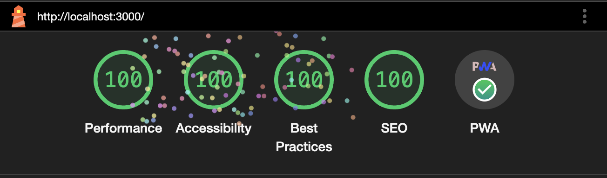
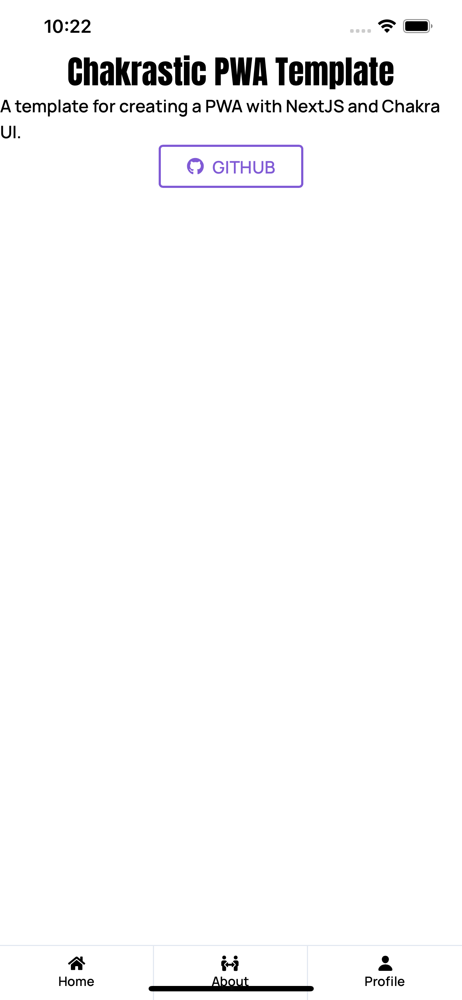
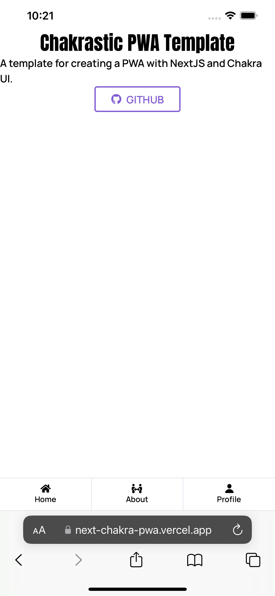
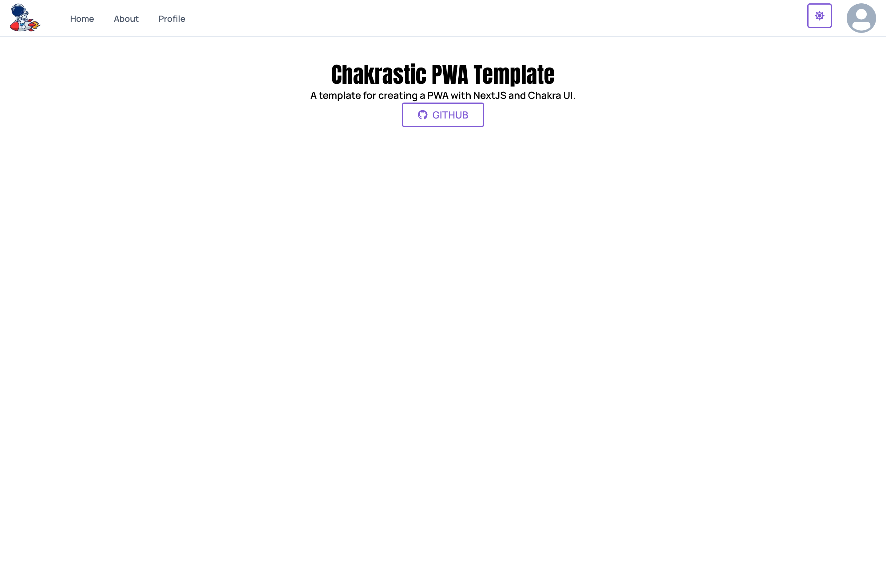

# Chakrastic PWA Template  
  
 
## Created with NextJS & ChakraUI  

This is a [Next.js](https://nextjs.org/) PWA template bootstrapped with [`create-next-app`](https://github.com/vercel/next.js/tree/canary/packages/create-next-app) and using CHAKRA UI 


## 100 Lighthouse Scores   
  

## 📲 App Like Mobile Experience  
  
  
  

## ⚡️ Getting Started  
First, install dependencies:
```bash
npm install
```

Copy the example env file to get started quickly. 
```bash
cp .env.example .env
```

Then, run the development server:

```bash
npm run dev
# or
yarn dev
# or
pnpm dev
# or
bun dev
```

Open [http://localhost:3000](http://localhost:3000) with your browser to see the result.

You can start editing the page by modifying `pages/index.tsx`. The page auto-updates as you edit the file.

This project uses [`next/font`](https://nextjs.org/docs/basic-features/font-optimization) to automatically optimize and load Inter, a custom Google Font.  

## 🚀 Deploy on Vercel

The easiest way to deploy your Next.js app is to use the [Vercel Platform](https://vercel.com/new?utm_medium=default-template&filter=next.js&utm_source=create-next-app&utm_campaign=create-next-app-readme) from the creators of Next.js.


## 🥳 Contributing  
We welcome contributions from the community to help improve and grow this project. Whether you're a developer, tester, or have other skills to offer, your contributions can make a difference.

### How to Contribute

1. **Fork the Repository:** Start by forking the Next-Chakra-PWA repository to your GitHub account. This will create a copy of the project that you can freely modify.

```bash
git clone https://github.com/your-username/Next-Chakra-PWA.git  
```

2.  **Create a New Branch:** Create a new branch for your contribution. Choose a descriptive branch name that reflects the changes you intend to make.
```bash
git checkout -b feature/my-new-feature
```  

3. **Make Changes:** Make your desired changes to the codebase. Whether it's fixing bugs, adding new features, improving documentation, or anything else, your contributions are valuable.

4. **Test Your Changes:** Before submitting your contribution, ensure that your changes work as expected. Run any necessary tests and verify that the project builds successfully.

```bash
Copy code
git add .
git commit -m "Add feature: My new feature"
git push origin feature/my-new-feature
```

5. **Create a Pull Request (PR):** Navigate to your forked repository on GitHub and create a new Pull Request. Provide a clear description of your changes, including any relevant context or reasoning.  

### Code Style and Guidelines  
Follow the existing code style and guidelines used in the project.
Write clear and concise code with meaningful variable names and comments where necessary.
Ensure your changes don't introduce any linting errors or warnings.
### Feedback and Bug Reports  
If you encounter any issues or have suggestions for improvement, please open an issue on GitHub. We appreciate feedback and value your input to make Next-Chakra-PWA better for everyone.

### 📣 Spread the Word  
Help us grow the Next-Chakra-PWA community! Share your experience with the project, star the repository, and encourage others to contribute. Together, we can build amazing things.

### Get in Touch
If you have any questions or need assistance with contributing, feel free to reach out. We're here to help and support your contributions.
